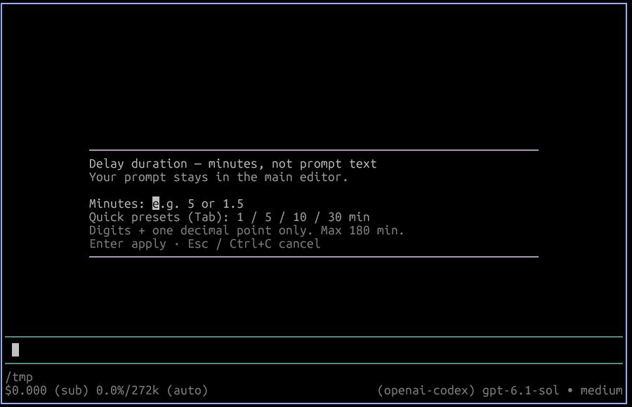

# pi-delay-prompt

Delay the next Pi prompt with a visible countdown. Useful for rate limits: arm a delay, type the prompt, and it sends after the timer (or send immediately / cancel and restore the editor).



## Install

From npm:

```sh
pi install npm:pi-delay-prompt
```

From GitHub:

```sh
pi install git:github.com/dirop1/pi-delay-prompt
```

From a local checkout:

```sh
pi install /path/to/pi-delay-prompt
```

Requires Node.js 22+ and Pi interactive terminal mode. Package metadata includes `pi-package` for discovery in the [Pi package gallery](https://pi.dev/packages).

## Usage

```text
/delay-prompt 5        Delay the next prompt by 5 minutes
/delay-prompt 1.5      Fractional minutes work
/delay-prompt 90s      Explicit seconds or minutes (s/sec/secs/second/seconds, m/min/mins/minute/minutes)
/delay-prompt cancel   Disarm (also: off, clear)
/delay-prompt          Prompt for minutes interactively
```

Plain numbers are minutes. Range is 1 second to 180 minutes. Slash commands are never delayed. Only one countdown runs at a time; overlapping prompts are sent normally instead of stacking.

With no argument, `/delay-prompt` opens a numeric-only duration picker, also used by `Ctrl+Alt+D`. Enter minutes (`5`, `1.5`, or `1,5`), or press `Tab` to cycle quick presets (1 / 5 / 10 / 30 minutes), then `Enter` to apply. Letters and multiline pastes are rejected; invalid durations show an inline error without closing the picker. `Esc` or `Ctrl+C` cancels. Your prompt belongs in the main editor, not the duration field.

Keyboard shortcut `Ctrl+Alt+D` delays the prompt currently in the editor (or arms the next one when the editor is empty).

During the countdown, `Enter` sends immediately and `Esc` cancels and restores the editor text.

## Example: give CI time to finish

If a CI pipeline usually takes a few minutes, arm a timed follow-up:

```text
/delay-prompt 5
```

Then write and submit your prompt:

```text
Check the latest CI pipeline for this branch. If it failed, inspect the failed jobs and summarize what needs fixing.
```

Pi holds the prompt for five minutes before sending it. This is a fixed delay, **not CI polling**: the pipeline may still be running when the prompt sends. The assistant needs the appropriate CLI or tools and authentication to inspect your CI provider. Press `Enter` during the countdown to send early, or `Esc` to cancel and restore the prompt.

Alternatively, write the prompt first, press `Ctrl+Alt+D`, and choose the delay.

## Development

```sh
npm test
npm run check
npm pack --dry-run --ignore-scripts
```

Core parsing/formatting helpers are dependency-free so tests run without Pi installed. Pi loads the TypeScript entrypoint directly; no build step is needed.

## License

MIT. See [LICENSE](./LICENSE).
